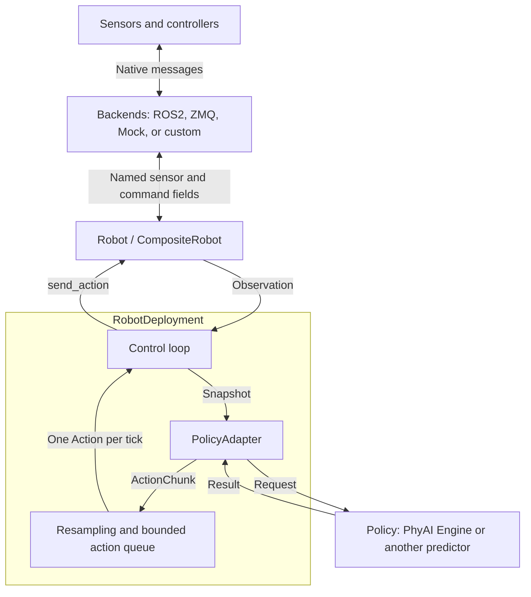

# phyai-robot

`phyai-robot` connects a policy to a robot: read sensor observations, turn them
into model inputs, and send the resulting actions at a configured control rate.
You can combine several device connections into one robot, reuse the same
deployment loop across robots, and replace the policy without rewriting device
communication.

The package runs independently of the PhyAI inference engine. Its core depends
only on NumPy and includes a Mock backend for development without hardware.
ROS2 and ZMQ backends handle device communication; the application supplies the
message conversions and controller-specific stop behavior.

- [Design and interfaces](#design-and-interfaces)
- [Install and run](#install-and-run)
- [Understand the dual-arm example](#understand-the-dual-arm-example)
- [Control timing](#control-timing)
- [Connect your robot](#connect-your-robot)

## Design and interfaces

Robot communication, model inference, and control timing have separate owners.
The robot exposes a fixed set of named sensor and command fields. The policy
accepts its own request type. Deployment connects them through an adapter and
maintains the action queue.



The design follows four rules:

1. **Describe data independently of robot structure.** A joint vector, camera
   image, or force measurement is a named observation field. Names such as
   `left.q` and `camera.front.rgb` are identifiers, not paths through a part tree.
2. **Compose connections by field ownership.** Each backend owns a fixed subset
   of observation and action keys. One connection can serve several arms or
   sensors, and one robot can use several transports.
3. **Keep model conventions in the adapter.** Image preprocessing, normalization,
   checkpoint joint order, and conversion of predicted deltas to absolute targets
   belong to `PolicyAdapter`. Device codecs handle native device units and messages.
4. **Keep scheduling in deployment.** The robot sends one command at a time.
   Deployment decides when to predict, how to resample a chunk, and when to send
   each command.

### Who implements what

| Interface | Contract | Your responsibility |
| --- | --- | --- |
| [`Robot`](src/phyai_robot/robot.py) | `observation_schema`, `action_schema`, `connect()`, `get_observation() -> Observation`, `send_action(Action)`, `stop()`, `close()` | Assemble `CompositeRobot` from backends, or implement this interface for an existing robot SDK. |
| [`Backend`](src/phyai_robot/backends/base.py) | `observation_keys`, `action_keys`, `connect()`, `read() -> Mapping[str, Sample]`, `write(Action)`, `stop()`, `close()` | Configure a supplied backend with codecs, or implement a new transport. |
| [`Policy[RequestT, ResultT]`](src/phyai_robot/policy.py) | `predict(RequestT) -> ResultT` | Supply a synchronous predictor. `EnginePolicy` delegates to an existing PhyAI engine's `step(request)`. |
| [`PolicyAdapter[RequestT, ResultT]`](src/phyai_robot/policy.py) | `to_request(Observation) -> RequestT`, `to_actions(ResultT, Observation) -> ActionChunk` | Match this robot's fields to this model's input and output conventions. |
| [`RobotDeployment`](src/phyai_robot/deployment.py) | `run(max_steps=None)`, `stop()` | Choose control frequency, queue limits, and freshness budgets. |

These interfaces use Python protocols. Your classes only need to implement the
methods with matching signatures; they do not need to inherit a framework base
class. Request and result types are application-defined and remain linked through
the generic parameters of the policy, adapter, and deployment.

### Data contracts

The public types live in [`types.py`](src/phyai_robot/types.py). Both schemas are
fixed mappings from field names to `FeatureSpec` and are available before connection.

| Type | Fields and meaning |
| --- | --- |
| `FeatureSpec` | `shape`: one sample's dimensions; `dtype`: NumPy dtype name; optional `unit`, `names` for ordered vector components, and `frame` for spatial values. |
| `Sample` | `value`: a NumPy array in the declared layout; `received_at_ns`: the local `time.monotonic_ns()` value when its message arrived. |
| `Observation` | `samples`: a mapping from every observation key to its `Sample`. Fields may have different receive times. |
| `Action` | A mapping from every action key to a NumPy array for **one control tick**. |
| `ActionChunk` | `actions`: a nonempty tuple of complete `Action` mappings; `step_period_s`: spacing between the model's targets. |

For example, `FeatureSpec((7,), "float32", unit="rad")` describes seven joint
positions. An RGB camera could use `FeatureSpec((480, 640, 3), "uint8")`; neither
field needs a parent body part. Shapes describe individual samples, without a
batch or trajectory dimension.

`CompositeRobot` validates keys, shapes, dtypes, and finite values. It does not
silently cast arrays, reorder joints, or convert units. The codecs must produce
values in the declared convention; `unit`, `names`, and `frame` document that
convention. A missing first sensor sample raises `ObservationNotReady` rather
than substituting zeros.

Snapshots and queued commands contain copied arrays with ordinary writes disabled.
Copy an array before passing it to code that modifies its input. A frozen
dataclass alone does not freeze its contained arrays, so a custom `Robot` must
also detach its returned observations from mutable receive buffers.

## Install and run

Use Python 3.12+ and [uv](https://docs.astral.sh/uv/). Run repository commands
from the **PhyAI repository root**, one directory above this README.

### Try the Mock example without a GPU

This command creates an isolated environment for the local package and runs the
complete [dual-arm example](../examples/robot/mock_loop.py):

```bash
uv run --no-project --isolated --with-editable ./phyai-robot \
  python examples/robot/mock_loop.py --steps 30
```

Expected output:

```text
Completed 30 steps; both backends stopped.
```

The example uses simulated feedback and a small CPU policy. It needs no PhyAI
engine, model weights, ROS installation, or external robot service. This command
does not synchronize the workspace's `.venv`.

### Install with PhyAI

Select PhyAI's `deployment` extra to install the Robot core and Mock backend
alongside the engine:

```bash
uv sync --package phyai --extra deployment
uv run --no-sync python examples/robot/mock_loop.py --steps 30
```

To include the Robot package's ZMQ dependencies, select that package and its
`zmq` extra too:

```bash
uv sync --package phyai --package phyai-robot --extra deployment --extra zmq
```

For all workspace members, including the native extension and optimizer, use
`uv sync --all-packages --extra zmq`.

`--package` selects workspace packages; `--extra` enables named optional
dependencies on the selected packages. Here, `deployment` belongs to `phyai`,
and `zmq` belongs to `phyai-robot`. A plain root `uv sync` installs the root
project's declared dependencies, which do not include `phyai-robot`.

Workspace commands share the root `.venv`. `uv sync` removes packages outside
the selected dependency set by default, so include the packages and extras you
need on subsequent syncs. Use `--inexact` when intentionally adding to an existing
environment while preserving other installed packages. `uv run --no-sync` runs
against the environment you have already prepared. See uv's
[workspace](https://docs.astral.sh/uv/concepts/projects/workspaces/) and
[sync](https://docs.astral.sh/uv/concepts/projects/sync/) documentation for details.

### Install Robot without the engine

Use a separate environment when developing device communication independently
of an existing PhyAI environment:

```bash
UV_PROJECT_ENVIRONMENT=.venv-robot \
  uv sync --package phyai-robot --no-default-groups

UV_PROJECT_ENVIRONMENT=.venv-robot \
  uv run --no-sync python examples/robot/mock_loop.py --steps 30
```

Add `--extra zmq` to the sync command for ZMQ. `--no-default-groups` omits default
development tool groups. Package selection limits what is installed, but uv still
resolves the workspace together. The isolated command above bypasses workspace
resolution if you only need to try Robot.

In an application outside this repository, declare the local package as an
editable dependency instead:

```bash
uv add --editable /path/to/phyai/phyai-robot --extra zmq
```

Replace the path with your checkout and omit `--extra zmq` for the core alone.
This records the dependency and source in your application's `pyproject.toml`.

### Backend dependencies

| Backend | Installation |
| --- | --- |
| Mock | Included in the core package. |
| ZMQ | The `zmq` extra installs `pyzmq`. |
| ROS2 | Source a ROS2 installation providing `rclpy` and the required message packages for your Python interpreter. The declared `ros2` extra has no pip dependencies and does not install ROS middleware. |

Importing `phyai_robot` or its backend modules does not load PhyAI, Torch, ROS2,
or ZMQ. Transport SDKs are loaded when the corresponding backend connects.

## Understand the dual-arm example

[`examples/robot/mock_loop.py`](../examples/robot/mock_loop.py) is a complete
application with two seven-joint arms, one gripper per arm, and an independent RGB
camera. Start with its `main()` function to see the composition:

| Backend instance | Observation keys | Action keys |
| --- | --- | --- |
| `arm_backend` | `left.q`, `right.q`, `camera.front.rgb` | `left.target_q`, `right.target_q` |
| `gripper_backend` | `left.width`, `right.width` | `left.target_width`, `right.target_width` |

Both are `MockBackend` instances. Their `action_to_observation` mappings copy
commanded arm positions and gripper widths into subsequent feedback. Each read
generates a fresh simulated measurement. The camera stays an independent field;
the Mock backend does not simulate motion dynamics or rendering.

### 1. Assemble the robot

`CompositeRobot` receives the two backends, an observation schema, and an action
schema. Each arm vector has shape `(7,)`, dtype `float32`, and unit `rad`.
Each gripper width has shape `(1,)`, dtype `float32`, and unit `m`.
The camera has shape `(32, 32, 3)` and dtype `uint8`.

The constructor checks that backend key sets cover each schema exactly, with no
duplicate owners. When sending a complete action, it validates every field before
passing each backend only its owned command subset.

### 2. Adapt observations to the policy

The example defines this model-facing type:

```python
from typing import TypeAlias
from collections.abc import Mapping

import numpy as np
from numpy.typing import NDArray

# Keys: "left.target_q" and "right.target_q"; each array has shape (7,), in radians.
JointPositions: TypeAlias = Mapping[str, NDArray[np.float32]]
```

`DualArmAdapter.to_request(observation: Observation) -> JointPositions` extracts
copies of `left.q` and `right.q`, naming them with the target keys used by this
toy policy. The request contains current joint positions. The policy does not
consume the camera or gripper feedback, although they remain required robot
observations and are still checked for freshness.

### 3. Predict targets and build a chunk

`SmallStepPolicy.predict(request: JointPositions) -> JointPositions` adds
`0.01` radians to each input joint position and returns absolute arm targets.
`DualArmAdapter.to_actions(result, observation) -> ActionChunk` adds the two
gripper targets, both `0.02` meters, and repeats the complete action eight times
at a spacing of `0.05` seconds.

For an initial joint reading of zero, the first chunk therefore holds each joint
at `0.01` radians and each gripper at `0.02` meters. Later predictions use newer
feedback. Each request/result mapping is a policy convention; the robot-facing
`Action` also includes all required gripper fields.

The adapter receives the **same observation used to create the request** when
converting the result. A model predicting joint deltas would add those deltas to
this snapshot. The example predicts absolute targets, so it needs no such addition.

### 4. Run the control loop

The example uses 20 Hz model targets and a 20 Hz control loop, with room for
sixteen source targets. With `--steps 30`, `run(max_steps=30)` connects the robot,
sends thirty commands, then stops and closes both backends.

The producer waits for an empty queue, reads an observation, runs inference,
and enqueues the retained prefix. The independent control loop interpolates
source targets at `control_hz`. **It sends nothing while the queue is empty.**
Observation and inference never run on the control tick, and the next snapshot
is not read until the previous chunk's last interval and send have finished.

```mermaid
sequenceDiagram
    participant R as Robot
    participant L as Control thread
    participant Q as Source action queue
    participant W as Observation/policy worker
    participant P as Policy
    L->>R: connect()
    loop Until max_steps, stop(), or failure
        Note over L,W: Empty queue: control waits without sending
        W->>R: get_observation() under I/O lock
        R-->>W: Observation
        W->>W: adapter.to_request(snapshot)
        W->>P: predict(request)
        P-->>W: result
        W->>W: adapter.to_actions(result, same snapshot)
        W->>Q: Validate, detach, enqueue execution_horizon source targets
        Note over L,W: Worker waits until the queue completely drains
        loop At control_hz for this chunk
            L->>Q: Read neighboring source targets, retire consumed targets
            L->>L: Interpolate continuous fields
            L->>R: send_action(action) under I/O lock
        end
        L->>Q: Release final target after its interval; notify worker
    end
    L->>R: stop() and close()
```

A condition variable protects the queue and chunk metadata. An I/O lock prevents
concurrent Robot reads, writes and shutdown; CompositeRobot needs no internal
synchronization changes. The application owns the policy and engine. Do not use
them or the robot concurrently while deployment owns their calls. Request
termination from another thread with `deployment.stop()`; `run()` performs the
hardware shutdown. Construct new robot/backend and deployment instances for
another run.

## Control timing

Configure timing with [`DeploymentOptions`](src/phyai_robot/deployment.py):

| Option | Default | Meaning |
| --- | --- | --- |
| `control_hz` | Required | Single-action submission frequency while a chunk executes. |
| `max_control_lateness_s` | `0.01` | Maximum allowed delay past a scheduled send, independent of `control_hz`; equality is allowed. |
| `action_hz` | `None` | Source target frequency; `None` uses `ActionChunk.step_period_s`. |
| `execution_horizon` | `None` | Number of source targets retained per prediction; `None` keeps the whole chunk. |
| `max_queued_actions` | `50` | Capacity in source targets, not interpolated commands. An oversized retained prefix is rejected. |
| `max_sample_age_s` | Required | Maximum receive age of every sensor at observation time. |
| `startup_timeout_s` | `5.0` | Budget for the first complete observation and usable chunk. |
| `observation_timeout_s` | `5.0` | Per-refill wait for complete, fresh sensor samples; no commands are sent while waiting. |
| `max_prediction_age_s` | `0.5` | Snapshot-to-send limit, including inference and execution time. |
| `shutdown_timeout_s` | `2.0` | Wait for in-flight prediction after hardware shutdown. |
| `interpolate_keys` | Empty | Floating-point fields interpolated linearly; other fields hold the preceding target. |

There is no low-watermark refill or prefetch. The old `queue_low_watermark`
option has been removed. Only one prediction runs at a time, and queue exhaustion
is a normal pause, not a failure. Missing/stale sensors are retried only while
idle, up to `observation_timeout_s`, without relaxing `max_sample_age_s`. A
sensor timeout, expired prediction, backend/policy failure, or control lateness
above `max_control_lateness_s` ends the run and attempts stop/close. The default
allows up to 10 ms of lateness, including at 200 Hz (a 5 ms period). A late wakeup
within this budget skips old control ticks and sends the latest due target, not
an accumulated burst. The chunk clock and source-action timing are unchanged.
Each new chunk gets a new clock, so waiting for observation/inference is not a
missed control deadline. Timing errors include the actual lateness, limit,
wakeup delay, I/O-lock wait, action-preparation time, and previous send duration.
This is a host-side check before `send_action`, not a ROS delivery-time guarantee;
it cannot interrupt a send already blocked inside a backend.

For a source period `dt` and retained horizon `N`, the execution interval is
`[0, N * dt)`. For time `t`, linearly interpolate between targets
`i = floor(t / dt)` and `i + 1`, with fraction `(t - i * dt) / dt`. Hold the final
target over its last source interval; never interpolate toward a discarded tail.
For `action_hz=25`, `control_hz=200`, and `execution_horizon=20`, twenty queue
entries normally yield 160 sends over a nominal 0.8-second chunk. Skipped ticks
reduce this count without stretching the trajectory. `max_steps` counts actual
sends and may stop partway through a chunk. No commands are emitted during the following
observation/inference gap.

Linear interpolation stays between adjacent endpoints, but does not impose
velocity/acceleration limits or handle pose rotations. There is no interpolation
across the inference gap, RTC, or hard real-time guarantee. The first source
action is sent directly: an application requiring a measured-state ramp must
provide one separately.

Choose freshness budgets that include sensor age, model latency, and execution
duration. Every required sensor needs a sample before prediction, even if the
adapter ignores it. Sensors are **not reread during execution**. Receive time is
not capture time and cannot establish sensor synchronization or detect replayed
frames. Device-side limits and watchdogs remain necessary, especially because
no host commands arrive during inference.

A blocked predictor cannot be forcibly cancelled. If it exceeds the shutdown
budget, `run()` reports the timeout after stopping hardware and discards the
worker's eventual result. Keep its engine alive until prediction has returned.

## Connect your robot

Start from the Mock example and replace one boundary at a time:

1. Define observation and action schemas in your robot's physical units and
   joint order. Include every required sensor, even if a particular policy does
   not consume it.
2. Configure backends for those fields. Reuse ROS2 or ZMQ where their transport
   model matches your controller; implement `Backend` for another protocol.
3. Assemble `CompositeRobot`, optionally supplying `action_guard(Action) -> None`
   to reject commands outside static physical limits before any writes. This
   callback must not mutate commands or perform I/O.
4. Implement the adapter for your policy checkpoint and choose deployment timing.
   The policy itself only needs `predict(request)`; `EnginePolicy(engine)` can
   wrap an existing PhyAI engine while your adapter handles its concrete types.

### Reuse the supplied backends

| Backend | Configure | Behavior |
| --- | --- | --- |
| [`MockBackend`](src/phyai_robot/backends/mock/backend.py) | `initial_values`, `action_to_observation` | Copies commands into mapped feedback; useful for testing schemas, adapters, and control logic. |
| [`Ros2Backend`](src/phyai_robot/backends/ros2/backend.py) | Per-field `RosObservation(topic, message_type, decode, qos)` and `RosCommand(topic, message_type, encode, qos)`; `on_stop(node)` for command backends | Subscribes to observations and publishes commands using an owned node, context, and executor on one worker thread. |
| [`ZmqBackend`](src/phyai_robot/backends/zmq/backend.py) | PUB/REP peer endpoints, owned keys, `decode_observation`, `encode_action`, `encode_stop`, and `check_reply` | Receives observations through SUB and submits commands through REQ/REP. Application codecs define the multipart byte format and validate acceptance replies. |

A ROS decoder must produce a NumPy array in the field's declared units, joint
order, and dtype. Its encoder performs the reverse conversion for the controller.
The `on_stop` callback runs on the backend's worker and must finish within the
I/O budget without waiting for callbacks on that same worker. This backend covers
topics; controllers requiring specialized ROS actions or services can implement
`Backend` directly. ROS2 integration tests are currently
[TODO](tests/backends/test_ros2.py).

For ZMQ, define an explicit stop message and check the reply from your device.
The backend does not choose a serialization format or automatically replay failed
commands. A timed-out REQ socket is replaced before the stop attempt. The
[local ZMQ tests](tests/backends/test_zmq.py) include a small peer and JSON codecs
that demonstrate the required exchange.

### Mix transports or add a new one

For ROS-controlled arms and CAN-controlled grippers, keep the example's field
ownership split: a `Ros2Backend` owns the arm fields and a custom CAN backend
owns the gripper fields. `CompositeRobot` merges their observations and routes
each action subset to its owner. A camera may belong to either connection or to
its own backend. CAN is not a bundled backend.

Implement the public [`Backend` protocol](src/phyai_robot/backends/base.py) for
the CAN session. `read()` must return cached, detached samples without waiting
for the next frame, preserving each field's local receive timestamp. It can
return incomplete data during startup. Bound connection and command waits,
surface receive-worker errors, and make stop/close tolerate repeated calls and
partial initialization. The shared `_threaded.py` helper is private to the
supplied transports; custom backends need not inherit it.

Successful `send_action()` means submission or transport acceptance, not physical
motion completion. Writes across independent connections cannot be atomic or
rolled back: if a later write fails, `CompositeRobot` attempts to stop all opened
backends. Device controllers remain responsible for their motion limits and
watchdogs when the host or communication link is unavailable.

## Run the package tests

Run the Mock, deployment, validation, and local ZMQ tests in an isolated environment:

```bash
uv run --no-project --isolated --with-editable './phyai-robot[zmq]' --with pytest \
  python -m pytest -c phyai-robot/pyproject.toml --confcutdir=phyai-robot phyai-robot/tests
```

The explicit pytest configuration and `--confcutdir` keep this package's tests
independent of the repository's CUDA test bootstrap. They need no GPU or physical
robot. See the [example](../examples/robot/mock_loop.py) for the complete application
and the [source directory](src/phyai_robot) for the typed interfaces and implementations.
